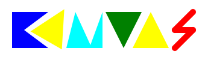
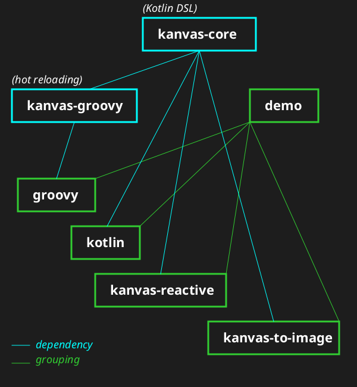
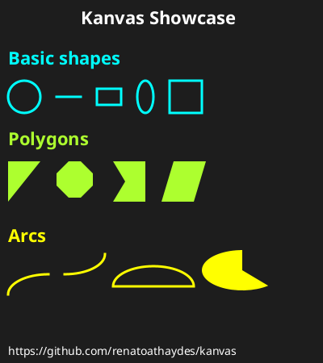
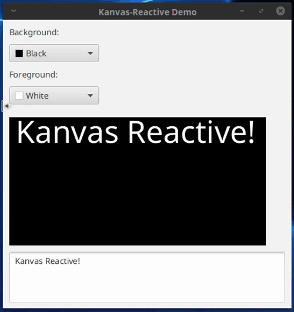

Kanvas is a library that makes it easy to draw on a JavaFX Canvas using
either a Kotlin or Groovy DSL.

## Modules

_This diagram, as well as the logo above, were produced by Kanvas itself
([Logo source code](demo/groovy/src/kanvas-logo.groovy) / [Diagram source code](demo/groovy/src/kanvas-project-diagram.groovy))!_



## Requirements

Kanvas requires Java 21+ with JavaFX.

> Hint: use [SDKMAN](https://sdkman.io) to obtain a suitable JDK
> (e.g. a Liberica or Zulu JDK with the `.fx` suffix).

### kanvas-core

> Maven coordinates: `com.athaydes.kanvas:kanvas-core:<version>`

The basic functionality of Kanvas. It's written in Kotlin and provides the basic API for drawing on a canvas
via the [com.athaydes.kanvas.Kanvas](kanvas-core/src/main/kotlin/com/athaydes/kanvas/kanvas.kt) class.

This library also provides an abstract class, `com.athaydes.kanvas.KanvasApp`, to make it easy to create a
`javafx.application.Application` implementation that displays a `Kanvas` and nothing else:

```kotlin
import com.athaydes.kanvas.Kanvas
import com.athaydes.kanvas.KanvasApp
import javafx.application.Application
import javafx.scene.paint.Color

fun main() {
    Application.launch(KanvasDemo::class.java)
}

class KanvasDemo : KanvasApp() {
    override fun draw(): Kanvas {
        return Kanvas(300.0, 250.0).apply {
            title("Kotlin Kanvas Demo")

            // draw your shapes here!
            background(Color.BLACK).fill(Color.BLUE)
            at(50.0, 30.0).circle(radius = 100.0, fill = true)
        }
    }
}
```

Result:


### Animations

If you want to create animations rather than static images, you can use the `loop` function within your `draw`
function implementation, as in the example below:

> To change the frame rate, use the `loopPeriod` function, which accepts a number (milliseconds) or `java.time.Duration`.

```kotlin
import com.athaydes.kanvas.Kanvas
import com.athaydes.kanvas.KanvasApp
import javafx.scene.paint.Color

class AnimationKanvasDemo : KanvasApp() {

  data class KanvasCircle(
    var x: Double = 0.0,
    var y: Double = 0.0,
    var vx: Double = 0.3,
    var vy: Double = 0.2,
    val diameter: Double = 40.0,
    var color: Color = Color.BLACK
  ) {
    fun update(k: Kanvas, dt: Long) {
      x += vx * dt
      y += vy * dt
      if (x + diameter > k.width || x < 0) {
        vx *= -1
        x = if (x < 0) 0.0 else k.width - diameter
      }
      if (y + diameter > k.height || y < 0) {
        vy *= -1
        y = if (y < 0) 0.0 else k.height - diameter
      }
      k.fill(color).at(x, y).circle(radius = diameter / 2, fill = true)
    }
  }

  val circles = listOf(
    KanvasCircle(color = Color.BLUE),
    KanvasCircle(color = Color.GREEN, x = 100.0, y = 140.0)
  )

  override fun draw(): Kanvas {
    return Kanvas(300.0, 250.0).apply {
      title("Kanvas Animation Demo")
      background(Color.INDIGO)
      loop { dt ->
        clear()
        circles.forEach { s -> s.update(this, dt) }
      }
    }
  }
}
```

Result:


### Observable State

Kanvas supports registering observable objects.

An Observable Object is one that extends `ObservableKanvasObject`. They are automatically redrawn when their state
is modified.

To register observable objects, call `Kanvas#manageKanvasObjects`.

[Kotlin Observable Objects Example](demo/kotlin/src/observable-objects.kt).

[Groovy Observable Objects Example](demo/groovy/src/observable-objects.groovy)

In Kotlin, observable fields are declared as follows:

```kotlin
class Example : ObservableKanvasObject() {
    var x by observable(50.0)
    var y by observable(100.0)
}
```

In Groovy, the `@Bindable` annotation must be used (so all public fields are observable):

```groovy
@CompileStatic
@Bindable
class Example extends ObservableKanvasObject {
    double x = 50, y = 100
}
```

## kanvas-groovy

> Maven coordinates: `com.athaydes.kanvas:kanvas-groovy:<version>`

A Groovy DSL based on `kanvas-core`.

It provides a base class for Groovy scripts exposing a nice DSL for Kanvas:

```groovy
import com.athaydes.kanvas.gr.KanvasScript
import groovy.transform.BaseScript
import javafx.scene.paint.Color

// this is here only to make the IDE auto-completion better!
@BaseScript KanvasScript baseScript

title 'Groovy Kanvas Demo'
width 300
height 250

background Color.BLACK
fill Color.BLUE
at 50, 30 circle 100, true
```

<details>

<summary style="font-size: large">More about Groovy (with hot reloading support)</summary>

Animations in Groovy work similarly to Kotlin:

> To make sure your animations run smoothly, it's a good idea to use `@CompileStatic`
> in the method or class that draws on the Kanvas, as in the example below.

```groovy
import com.athaydes.kanvas.Kanvas
import com.athaydes.kanvas.gr.KanvasScript
import groovy.transform.BaseScript
import groovy.transform.CompileStatic
import javafx.scene.paint.Color

import java.time.Duration

@BaseScript KanvasScript baseScript

title 'Groovy Animation Demo'
width 300
height 250

@CompileStatic
class KanvasCircle {
  double x = 30
  double y = 30
  double vx = 0.3
  double vy = 0.2
  final double diameter = 40
  Color color

  void update(Kanvas k, long dt) {
    x += vx * dt
    y += vy * dt
    // keep the circle within the canvas
    if (x + diameter > k.width || x < 0) {
      vx *= -1
      x = x < 0 ? 0 : k.width - diameter
    }
    if (y + diameter > k.height || y < 0) {
      vy *= -1
      y = y < 0 ? 0 : k.height - diameter
    }
    k.fill color
    k.at x, y circle((diameter / 2.0).doubleValue(), true)
  }
}

final circles = [
        new KanvasCircle(color: Color.BLUE),
        new KanvasCircle(color: Color.GREEN, x: 100, y: 140),
]

background Color.INDIGO

loopPeriod Duration.ofMillis(15)

loop { long dt ->
  clear()
  circles*.update(kanvas, dt)
}
```

_Both Groovy examples produce equivalent results as the Kotlin examples shown earlier._

#### Hot reloading Groovy scripts

This library also provides a JavaFX application class, `com.athaydes.kanvas.gr.GroovyKanvasApp`, that can launch a
Groovy script and hot-reload it as it changes.

All files under the same directory tree as the Groovy script are watched.

For details on how to run Kanvas Groovy scripts, see the [Groovy Demo](demo/groovy/).

</details>

## Demos

[Kotlin Demo](demo/kotlin/)

Contains several Kotlin examples similar to the Groovy examples below.

[Groovy Demo](demo/groovy/)

Includes several Groovy scripts demonstrating Kanvas created with kanvas-groovy. The scripts can be launched via a
stand-alone Groovy launcher or from a normal jar built from a Gradle project.

* [kanvas-project-diagram.groovy](demo/groovy/src/kanvas-project-diagram.groovy) (the diagram shown at the top of this page)
* [animation.groovy](demo/groovy/src/animation.groovy) (simple animation)
* [sprites.groovy](demo/groovy/src/sprites.groovy) (shows keyboard event handling, usage of sprites and transformations)
* [observable-objects.groovy](demo/groovy/src/observable-objects.groovy) (usage of observable objects to implement mouse
  dragging)
* [turtle.groovy](demo/groovy/src/turtle.groovy) (Logo Turtle-inspired API)
* [showcase.groovy](demo/groovy/src/showcase.groovy) (shown below)



[Kanvas-Reactive](demo/kanvas-reactive/)

A Kotlin example that shows how [ReduxKotlin](https://reduxkotlin.org/) can be used to create a reactive JavaFX 
application that uses Kanvas.



[Kanvas-To-Image](demo/kanvas-to-image/)

Another Kotlin example that shows how to save a Kanvas as an image file (e.g. PNG).

## Development

To build the jars:

    ./gradlew jar

To also execute the tests:

    ./gradlew check

To install the current version of the library in your local maven cache, use

    ./gradlew install

Since this library uses JavaFX, make sure that you use a JDK with JavaFX! For example,
using [SDKMAN!](https://sdkman.io/):

    sdk install java 21.0.2.fx-librca

### Logging

Kanvas logs using the Java System Logger. The easiest way to configure JUL (which is used by default
if you don't configure a logging framework):

1. create a config file, e.g. `jul.properties`.
2. run java with the argument `-Djava.util.logging.config.file=jul.properties`.
