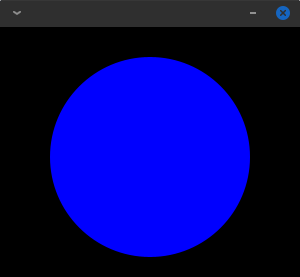

# Kanvas

This project contains a few libraries to make it easy to draw on a JavaFX Canvas using
either a Kotlin or Groovy DSL.

## Libraries

### kanvas-core

> Maven coordinates: `com.athaydes.kanvas:kanvas-core:<version>`

The basic functionality of Kanvas. It's written in Kotlin and provides the basic API for drawing on a canvas
via the [com.athaydes.kanvas.Kanvas](kanvas-core/src/main/kotlin/com/athaydes/kanvas/kanvas.kt) class.

This library also provides an abstract class, `com.athaydes.kanvas.KanvasApp`, to make it easy to create a
`javafx.application.Application` implementation that displays a `Kanvas` and nothing else:

```kotlin
import com.athaydes.kanvas.Kanvas
import com.athaydes.kanvas.KanvasApp
import javafx.application.Application
import javafx.scene.paint.Color

fun main() {
    Application.launch(KanvasDemo::class.java)
}

class KanvasDemo : KanvasApp() {
    override fun draw(): Kanvas {
        return Kanvas(300.0, 250.0).apply {
            // draw your shapes here!
            background(Color.BLACK).fill(Color.BLUE).stroke(paint = Color.GREEN, width = 3.0)
            at(50.0, 30.0).circle(radius = 100.0, fill = true)
        }
    }
}
```

Result:



## kanvas-groovy

> Maven coordinates: `com.athaydes.kanvas:kanvas-groovy:<version>`

A Groovy DSL based on `kanvas-core`.

It provides a base class for Groovy scripts exposing a nice DSL for Kanvas:

```groovy
import com.athaydes.kanvas.gr.KanvasScript
import groovy.transform.BaseScript
import javafx.scene.paint.Color

@BaseScript KanvasScript baseScript

title 'Groovy Kanvas Demo'
width 300
height 250

background Color.BLACK
fill Color.BLUE
stroke Color.GREEN, 3
at 50, 30 circle 100, true
```

#### Hot reloading Groovy scripts

This library also provides a JavaFX application class, `com.athaydes.kanvas.gr.GroovyKanvasApp`, that can launch a
Groovy script and hot-reload it as it changes.

All files under the same directory tree as the Groovy script are watched.

For details on how to run Kanvas Groovy scripts, see the [Groovy Demo](demo/groovy/README.MD).

## Demos

[Kotlin Demo](demo/kotlin/src/basic.kt)

[Groovy Demo](demo/groovy/src/demo.groovy)

[Showcase (Groovy)](demo/groovy/src/showcase.groovy)
